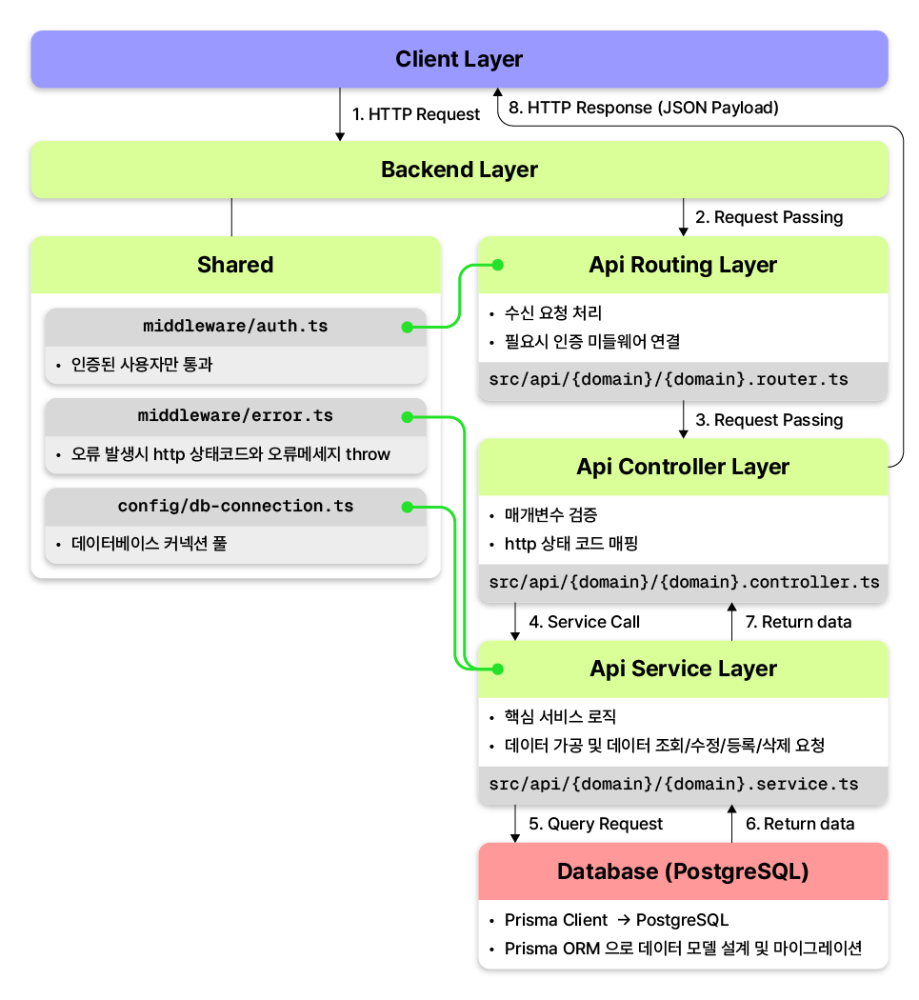
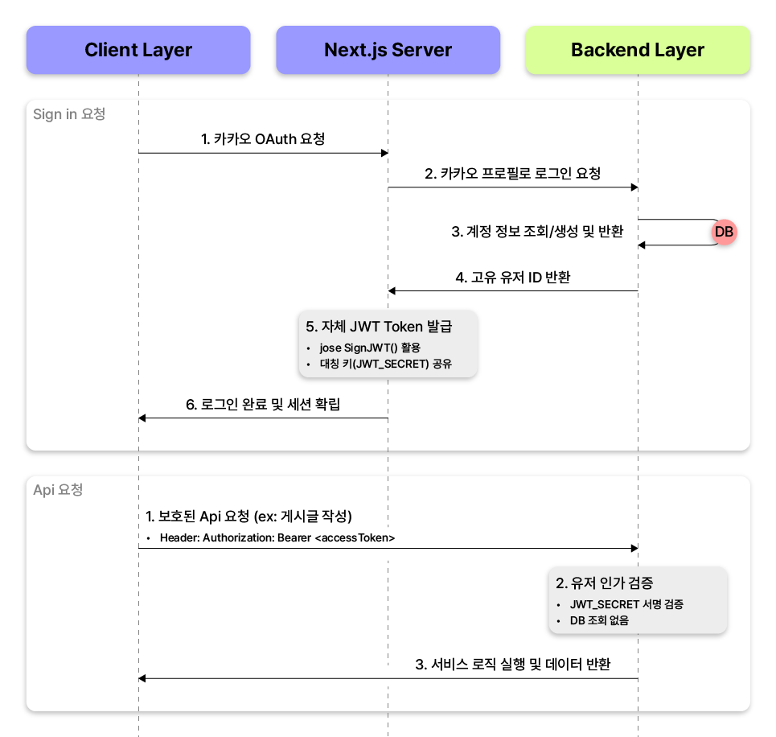

# MKST Backend
블로그 서비스를 위한 Node.js/Express 기반 백엔드 API 서버입니다. 기능별로 역할을 명확히 나눈 폴더 구조를 갖추고 있으며, Next.js 프론트엔드와 효율적으로 토큰을 주고받는 로그인 인증을 구현했습니다. 로컬 개발 환경과 실제 홈 서버 운영 환경 모두 Docker를 활용해 손쉽게 띄우고 관리할 수 있도록 구성했습니다.

## 기술 스택
* **Runtime & Language:** Node.js, TypeScript
* **Framework:** Express.js
* **ORM & Database:** Prisma ORM, PostgreSQL
* **Authentication:** NextAuth (Kakao OAuth) + 자체 서명 대칭키 JWT (jose)
* **Infrastructure & Deployment:** Ubuntu Server CLI (Self-hosted), Docker, Docker Compose

## 아키텍처 및 디렉터리 설계
단순한 기능 분할을 넘어, 기능 추가 및 수정 시 부작용을 최소화하고 코드의 재사용성을 높이기 위해 **도메인 계층화**와 **횡단 관심시 격리**를 결합한 디렉터리 구조를 설계했습니다.



```
mkst_backend/
├── prisma/
│   ├── migrations/            # 데이터베이스 변경 이력 기록 폴더
│   └── schema.prisma          # 데이터베이스 테이블 구조 및 모델 정의
├── public/
│   └── uploads/               # 이미지 등 업로드 파일 저장소 (Docker 외부 볼륨 연결)
├── src/
│   ├── api/                   # 주요 기능별 API 모음
│   │   ├── auth/              # 로그인 및 회원가입 처리 (Controller-Router-Service-Types)
│   │   ├── blog/              # 블로그 관리 (게시글/댓글 CRUD, URL 주소 생성, 목차 추출)
│   │   ├── upload/            # 이미지 파일 업로드 처리
│   │   └── search.ts          # 블로그 통합 검색 기능
│   ├── shared/                # 프로젝트 전체에서 공통으로 쓰는 코드 모음
│   │   ├── config/            # DB 연결 및 파일 경로 공통 설정
│   │   ├── http/              # 통일된 API 응답 형식 관리
│   │   ├── middlewares/       # 로그인 토큰 검사 및 공통 에러 처리 미들웨어
│   │   └── types/             # 공통 타입(TypeScript) 정의
│   └── server.ts              # 전체 서버 시작점 및 기본 설정 연결
├── docker-compose.dev.yml     # 로컬 개발용: DB만 따로 실행하는 도커 설정
├── docker-compose.yml         # 실제 배포용: 서버와 DB를 한 번에 같이 띄우는 도커 설정
└── Dockerfile                 # 서버 프로그램 배포용 도커 이미지 빌드 파일
```

### 설계 의도 및 장점
* **기능 단위 응집도 확보 (`src/api/{domain}`):** `auth`, `blog`, `upload` 등 도메인별 폴더 안에 `router`, `controller`, `service`를 모아두어, 특정 기능을 수정할 때 다른 도메인 코드를 건드리지 않도록 격리했습니다.
* **공통 관심사 분리 (`src/shared`):** 인증 검사, 공통 에러 핸들링, DB 연결 설정 등 여러 기능에서 반복해 쓰이는 로직을 한곳에 모아 중복 코드를 줄이고 유지보수성을 챙겼습니다.
* **유연한 구조 적용:** 하위 로직이 단순한 `search` 기능은 굳이 `router-controller-service`로 잘게 쪼개지 않고 단일 파일(`search.ts`)로 구성해 불필요한 파일 생성을 방지했습니다.

## 사용자 인증/인가 절차

Next.js와 Express 백엔드가 분리된 환경에서 별도의 세션 DB나 무거운 인증 인프라 없이도 빠르고 안전하게 인증을 처리할 수 있도록, **Next.js 서버 세션과 연동된 경량화 JWT 구조**를 설계했습니다.



### 방식별 비교분석
| 구분 | 1. 백엔드 전담 세션/토큰 | 2. NextAuth 기본 세션만 사용 | 3. 채택한 방식 (NextAuth + 대칭키 JWT) |
|---|---|---|---|
| 토큰 발급 주체 | Express 서버 | Next.js 내부 세션 | Next.js 서버 런타임 (`SignJWT`) |
| 백엔드 인가 방식 | DB 토큰 조회 및 매번 갱신 | NextAuth JWE 복호화 필요 | 공유 대칭키 기반 무상태(Stateless) 검증 |
| 인프라 복잡도 | 높음 (토큰 저장용 DB 테이블 및 로직 필요) | 보통 (Express 연동 시 복호화 로직 까다로움) | 최적 (토큰 테이블 불필요, 백엔드는 검증만 수행) |

### 구현 상세

* **소셜 로그인 대행 및 자체 DB 유저 연동:** NextAuth를 소셜 로그인 팝업 및 인가 코드 처리 도구로 활용했습니다. 로그인이 완료되면 백엔드 API(`/api/auth/signin`)를 호출해 PostgreSQL DB에 사용자를 저장/조회하고, 생성된 내부 유저 ID(PK)를 토큰 세션(`token.sub`)에 연결해 외부 로그인 서비스에 종속되지 않는 고유 계정 체계를 유지했습니다.
* **Next.js 서버 환경 기반 자체 토큰 서명:** NextAuth의 `session` 콜백이 브라우저가 아닌 Node.js 서버 환경에서 실행된다는 점을 활용했습니다. 백엔드와 공유하는 비밀키(`JWT_SECRET`)로 15분간 유효한 짧은 수명의 JWT를 생성해 클라이언트에 제공합니다.
* **백엔드 무부하 인가 처리:** 클라이언트가 요청을 보낼 때마다 Express 미들웨어(`auth.middleware.ts`)가 토큰의 **서명 유효성과 만료 시간만 자체 검증**합니다. 인가를 위해 매번 DB를 조회하지 않으므로 백엔드 응답 속도를 크게 개선했습니다.

## 게시글 엔진 핵심 기술

블로그 서비스의 핵심인 게시글 로딩 속도와 읽기 경험, 그리고 검색 최적화(SEO)를 고려해 백엔드 처리 파이프라인을 구축했습니다.

### 이미지 메타데이터 사전 저장 (CLS 방지)

* **문제 상황:** 본문 렌더링 시 이미지가 뒤늦게 로드되면서 본문 텍스트가 덜컥거리며 밀려 내려가는 현상(Cumulative Layout Shift)이 발생해 읽기 흐름을 방해했습니다.
* **해결 방법:** 이미지 업로드 시점에 서버에서 가로·세로 픽셀 크기와 비율 메타데이터를 추출해 본문 데이터와 함께 DB에 저장했습니다. 프론트엔드가 이미지를 내려받기 전에도 레이아웃 공간(Placeholder)을 미리 잡아둘 수 있어 화면 흔들림 없는 안정적인 렌더링을 구현했습니다.

### 목차(TOC) 사전 추출 및 클라이언트 런타임 부하 제거 (```toc.util.ts```)

* **문제 상황:** 사용자가 글을 조회할 때마다 브라우저에서 본문 전체 DOM을 뒤져 헤딩(`h1`, `h2`, `h3`) 태그와 목차 트리를 파싱하면, 글이 길어질수록 렌더링 지연과 연산 부하가 생겼습니다.
* **해결 방법:** 게시글을 등록하거나 수정할 때 백엔드 파이프라인에서 본문 구조를 미리 읽어 계층형 TOC 트리 객체를 만들어 DB에 저장했습니다. 클라이언트는 추가 연산 없이 완성된 목차 데이터를 바로 렌더링할 수 있어 초기 페이지 진입 속도가 향상되었습니다.

### 3. SEO 친화적 한글 슬러그 파이프라인 (`slugify.ts`)
* **문제 상황:** 난수형 ID(`/posts/clx91...`) 형태의 URL은 주소만 보고 글 내용을 짐작하기 어렵고 검색엔진 크롤러가 문서 맥락을 파악하는 데 불리했습니다.
* **해결 방법:** 한글 제목과 띄어쓰기를 표준 URL 규격으로 안전하게 정규화하는 파이프라인을 구축했습니다. 동일 제목 작성 시 발생할 수 있는 중복 충돌을 방지하기 위해 끝자리에 고유 4자리 해시를 덧붙여 고유성을 확보하고 검색 접근성을 높였습니다.

## 개발 환경 및 배포 전략
로컬 개발의 편의성과 홈 서버(Ubuntu CLI) 운영 환경의 일관성을 유지하기 위해 **듀얼 도커 컴포즈(Dual Docker Compose)** 방식을 적용했습니다.

* **로컬 개발 환경 (`docker-compose.dev.yml`):** DB(PostgreSQL)만 도커 컨테이너로 띄우고, 백엔드 서버 코드는 로컬에서 `tsx watch`로 실행하여 코드 수정 시 즉각적인 핫 리로딩과 빠른 디버깅이 가능하도록 구성했습니다.
* **운영 배포 환경 (`docker-compose.yml` & `Dockerfile`):** 다단계 빌드(Multi-stage build)를 적용한 경량 Docker 이미지를 생성하고, 볼륨 마운트를 통해 업로드된 정적 미디어 파일과 DB 데이터를 컨테이너 외부 호스트 스토리지에 영구 보존하도록 설정했습니다.